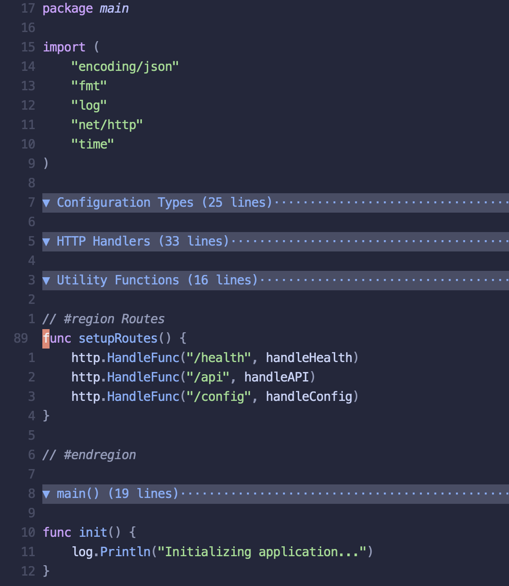

# region-folding.nvim

A Neovim plugin that enables code folding using region markers in comments across multiple programming languages. The plugin automatically detects language-specific comment syntax and allows you to organize your code into collapsible regions.



## Features

- Automatic code folding based on region markers in comments
- Support for 20+ programming languages out of the box
- Smart detection of language-specific comment syntax
- Descriptive fold text showing region titles and line counts
- Minimal configuration required

## Installation

Default configuration:
```lua
{
  "nicolas-martin/region-folding.nvim",
  event = { "BufReadPost", "BufNewFile" },
  opts = {
    -- Region marker text (without comment syntax)
    region_text = {
      start = "#region",
      ending = "#endregion",
    },
    -- Control spacing between comment and region text
    space_after_comment = true,
    -- Customize the fold indicator symbol
    fold_indicator = "▼",
  },
}
```

## Usage

### Region Markers

The plugin recognizes region markers in the following format:
```
<comment_char> #region [description]
code to fold...
<comment_char> #endregion
```

Examples in different languages:

```javascript
// #region Database Configuration
const config = {
    host: 'localhost',
    port: 3000
};
// #endregion
```

```python
# #region Helper Functions
def validate_input(data):
    pass

def process_data(data):
    pass
# #endregion
```

```lua
-- #region Plugin Setup
local config = {
    enabled = true,
    debug = false
}
-- #endregion
```

```go
// #region HTTP Handlers
func handleGetUser(w http.ResponseWriter, r *http.Request) {
    // Implementation
}

func handleCreateUser(w http.ResponseWriter, r *http.Request) {
    // Implementation
}
// #endregion
```

### Default Fold Navigation

#### Opening and Closing Folds

| Command | Description |
|---------|-------------|
| `zo` | Open fold under cursor |
| `zc` | Close fold under cursor |
| `za` | Toggle fold under cursor |
| `zO` | Open all folds under cursor recursively |
| `zC` | Close all folds under cursor recursively |
| `zA` | Toggle all folds under cursor recursively |

#### Global Fold Operations

| Command | Description |
|---------|-------------|
| `zR` | Open all folds in the file |
| `zM` | Close all folds in the file |
| `zr` | Reduce folding by one level throughout the file |
| `zm` | Increase folding by one level throughout the file |

#### Moving Between Folds

| Command | Description |
|---------|-------------|
| `zj` | Move to next fold |
| `zk` | Move to previous fold |
| `]z` | Move to end of current open fold |
| `[z` | Move to start of current open fold |

### Supported Languages

Out of the box support for:
- JavaScript/TypeScript (`// #region`)
- Python (`# #region`)
- Lua (`-- #region`)
- Go (`// #region`)
- Ruby (`# #region`)
- PHP (`// #region`)
- C/C++ (`// #region`)
- Java (`// #region`)
- Rust (`// #region`)
- Shell scripts (`# #region`)
- YAML/TOML (`# #region`)
- And more...

## Configuration

The plugin accepts the following options:

```lua
opts = {
  -- Region marker text (without comment syntax)
  region_text = {
    start = "#region",    -- Default: "#region"
    ending = "#endregion" -- Default: "#endregion"
  },
  -- Control spacing between comment and region text
  space_after_comment = true, -- Default: true
  -- Customize the fold indicator symbol
  fold_indicator = "▼",      -- Default: "▼"
}
```

## Fold Display

When a region is folded, it shows:
- The region description (if provided)
- The number of lines folded
- A fold indicator (customizable via the `fold_indicator` opt)

The plugin uses a distinct visual style for fold indicators:
- Folded regions show as `▼` by default (customizable)
- The fold indicator appears at the start of each folded region
- Nested regions are indented to show hierarchy

Example of how folded regions appear:
```
▼ Configuration Constants (8 lines)
▼ Database Types (12 lines)
▼ HTTP Handlers (16 lines)
▼ Server Setup (12 lines)
```
